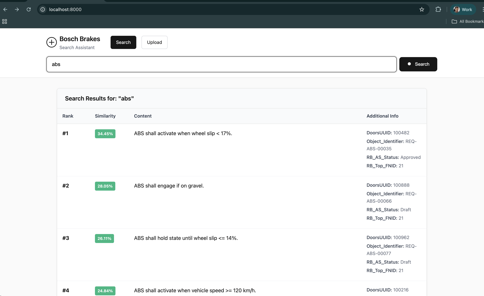
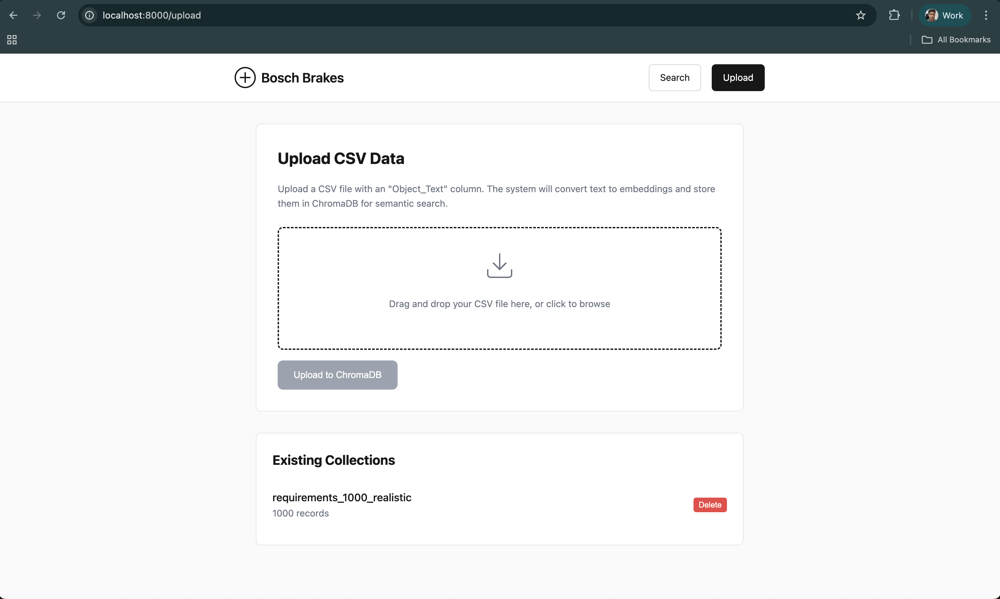

# Brakes Search Assistant

A semantic search application for brake-related data using FastAPI, ChromaDB, and sentence-transformers. Upload CSV files with brake data and search using natural language queries.

## 🐳 Quick Start with Docker

### Prerequisites
- Docker and Docker Compose installed
- At least 4GB RAM available for the container

### Installing Docker & Docker Compose

#### Windows
1. **Download Docker Desktop**: [Docker Desktop for Windows](https://docs.docker.com/desktop/install/windows-install/)
2. **Install Docker Desktop**: Run the installer and follow the setup wizard
3. **Enable WSL 2**: Docker Desktop will guide you through WSL 2 setup if needed
4. **Verify Installation**:
   ```bash
   docker --version
   docker-compose --version
   ```

#### macOS
1. **Download Docker Desktop**: [Docker Desktop for Mac](https://docs.docker.com/desktop/install/mac-install/)
2. **Install Docker Desktop**: Drag to Applications folder and start
3. **Grant Permissions**: Allow Docker to access your system when prompted
4. **Verify Installation**:
   ```bash
   docker --version
   docker-compose --version
   ```

#### Linux (Ubuntu/Debian)
```bash
# Update package index
sudo apt-get update

# Install Docker
sudo apt-get install docker.io docker-compose

# Add user to docker group
sudo usermod -aG docker $USER

# Start Docker service
sudo systemctl start docker
sudo systemctl enable docker

# Log out and back in, then verify
docker --version
docker-compose --version
```

#### Linux (CentOS/RHEL/Fedora)
```bash
# Install Docker
sudo dnf install docker docker-compose  # Fedora
# OR
sudo yum install docker docker-compose  # CentOS/RHEL

# Start Docker service
sudo systemctl start docker
sudo systemctl enable docker

# Add user to docker group
sudo usermod -aG docker $USER

# Log out and back in, then verify
docker --version
docker-compose --version
```

### 1. Clone and Navigate
```bash
git clone <repository-url>
cd raja-pjt-2
```

### 2. Download the Model (Required)

1. **Download from Hugging Face**: [all-MiniLM-L6-v2](https://huggingface.co/sentence-transformers/all-MiniLM-L6-v2)
2. **Extract to project directory**: Place the model files in `./models/all-MiniLM-L6-v2/`
3. **Verify structure**: The directory should contain:
   ```
   models/all-MiniLM-L6-v2/
   ├── config.json
   ├── pytorch_model.bin
   ├── sentence_bert_config.json
   ├── special_tokens_map.json
   ├── tokenizer_config.json
   └── vocab.txt
   ```

**Note**: The model is ~90MB and required for semantic search functionality.

### 3. Build and Run
```bash
# Build the Docker image
docker-compose up --build
```

### 4. Access the Application
Open your browser and go to: `http://localhost:8000`

## 📋 Docker Commands

### Start the Application
```bash
docker-compose up -d
```

## Data Persistence

The application uses Docker volumes to persist data:

- **Models**: `./models` → `/app/models` (read-only)
- **Vector Database**: `./chroma_db` → `/app/chroma_db`
- **Uploads**: `./uploads` → `/app/uploads`

### Backup Data
```bash
# Backup ChromaDB data
cp -r ./chroma_db ./chroma_db_backup

# Backup uploaded files
cp -r ./uploads ./uploads_backup
```

## 🚀 Usage

### 1. Upload Data
1. Go to `http://localhost:8000/upload`
2. Upload a CSV file with an "Object_Text" column
3. The system will convert text to embeddings and store in ChromaDB

### 2. Search Data
1. Go to `http://localhost:8000`
2. Type your question in natural language
3. View results in a clean tabular format

### 3. Manage Collections
- View collections: `GET /collections`
- Delete collection: `DELETE /collections/{name}`

## 📊 API Endpoints

| Endpoint | Method | Description |
|----------|--------|-------------|
| `/` | GET | Main search interface |
| `/upload` | GET | File upload interface |
| `/chat` | POST | Semantic search endpoint |
| `/upload` | POST | File upload endpoint |
| `/collections` | GET | List all collections |
| `/collections/{name}` | DELETE | Delete a collection |

## 🏗️ Project Structure

```
raja-pjt-2/
├── main.py                 # FastAPI application
├── requirements.txt        # Python dependencies
├── Dockerfile             # Docker image definition
├── docker-compose.yml     # Docker services
├── .dockerignore          # Docker ignore rules
├── static/                # Static HTML/CSS/JS files
│   ├── chat.html         # Search interface
│   └── upload.html       # Upload interface
├── models/               # Local sentence-transformers model
├── chroma_db/           # ChromaDB data (persistent)
└── uploads/             # Uploaded files (persistent)
```

## 🔍 Troubleshooting

### Container Won't Start
```bash
# Check container logs
docker-compose logs

# Check if port 8000 is available
lsof -i :8000

# Restart Docker service
sudo systemctl restart docker
```


### Permission Issues
```bash
# Fix volume permissions
sudo chown -R $USER:$USER ./chroma_db ./uploads ./models
```


## 🔧 Manual Setup (Alternative)

If you prefer to run without Docker:

### Prerequisites
- Python 3.12
- pip

### 1. Create Virtual Environment
```bash
python -m venv venv
source venv/bin/activate  # On Windows: venv\Scripts\activate
```

### 2. Install Dependencies
```bash
pip install -r requirements.txt
```

### 3. Download Model
```bash
python download_model.py
```

### 4. Run Application
```bash
python main.py
```
This project is for internal use at Bosch Brakes. 

## Demo



